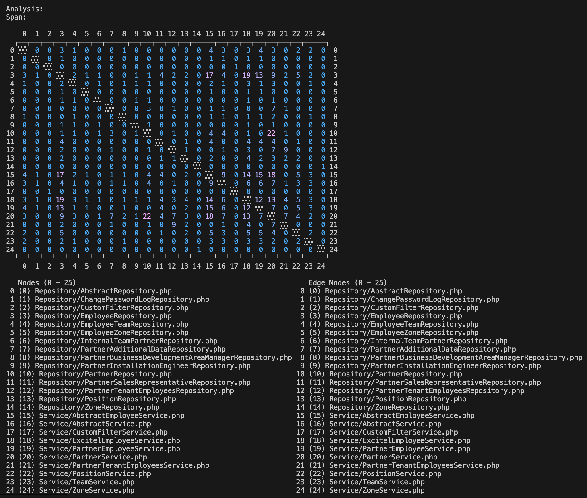

# Osmium

This is a prototype tool for exploring the dependencies between elements in a software system module by analyzing the evolution of the source files that contain these elements.

## Overview

Osmium uses the DSM ([Design Structure Matrix](https://en.wikipedia.org/wiki/Design_structure_matrix)) methods to measure and visualize the cohession between files in a GitHub repository by tracking how often these files have been changed together in a logical units like Git commits or GitHub pull requests.
It is implemented as a CLI application with commands for generating analyses and building different views (presentations) on them.
It is also available as a [GitHub CLI extension](https://github.com/zdrgeo/gh-osmium).

Analysis View in terminal



Analysis View in web browser


## Quick start

```
osmium analysis create --analysis-name="eShop" --source="github:pullrequest" --source-opt
ion="repository-owner=dotnet,repository-name=eShop"

osmium analysis create --analysis-name="dapr" --source="github:pullrequest" --source-option="repository-owner=dapr,repository-name=dapr"
```

```
osmium view create --analysis-name="eShop" --view-name="src" --node-name="^src(/[^/]+)*/[^/]+\.cs$"

osmium view create --analysis-name="dapr" --view-name="dapr" --node-name="^dapr(/[^/]+)*/[^/]+\.proto$" --node-name="^cmd(/[^/]+)*/[^/]+\.go$" --node-name="^pkg(/[^/]+)*/[^/]+\.go$" --node-name="^utils(/[^/]+)*/[^/]+\.go$"
```

```
osmium view web-browser render --analysis-name="eShop" --view-name="src"

osmium view web-browser listen --analysis-name="eShop" --view-name="src"

osmium view web-browser render --analysis-name="dapr" --view-name="dapr"

osmium view web-browser listen --analysis-name="dapr" --view-name="dapr"
```

## Concepts

- Analysis
- Modules
- Spans and Changes
- Nodes and Edges
- Views

The data model can be built based on data from various sources.
When GitHub Pull Request source is used, Osmium iterates over all pull requests.
When Git Commit source is used, Osmium iterates over all commits.

## Usage

### Workflow

Osmium's workflow is organized into three stages: generate an analysis, generate at least one view of the analysis, explore the views.
The output of each stage is persisted and can be used mutiple times as input for the next stage.
This enables iterative style of work - each stage can be repeated with the same input, but with different parameters to produce differenet outputs for the next stage.
This also helps with time- and resource-intensive stages such as the analysis generation, where multiple API calls (which may also be subject of rate limits) are often required to obtain the necessary historical data from the source.

### Configuration

```
# config.env

BASEPATH=
SOURCE=github:pullrequest
GITHUB_TOKEN=
```

### Commands to manipulate the DSM analyses

```
osmium analysis create
    --analysis-name -an
    --source -s {github:pullrequest, git:commit}
    [--source-option -so]

osmium analysis change
    --analysis-name -an
    --source -s {github:pullrequest, git:commit}
    [--source-option -so]

osmium analysis delete
    --analysis-name -an
```

`osmiumm analysis create`
| Parameter | Default | Optional | Description |
|--|--|--|--|
| --analysis-name -an | | | Name of the analysis. |
| --source -s | github:pullrequest | | Source of the analysis - github:pullrequest or git:commit. |
| --source-option -so | | Yes | Options of the source. If the source is github:pullrequest - repository-owner and repository-name. If the source is git:commit - repository-url and repository-path. |

`osmiumm analysis change`
| Parameter | Default | Optional | Description |
|--|--|--|--|
| --analysis-name -an | | | Name of the analysis. |
| --source -s | github:pullrequest | | Source of the analysis - github:pullrequest or git:commit. |
| --source-option -so | | Yes | Options of the source. If the source is github:pullrequest - repository-owner and repository-name. If the source is git:commit - repository-url and repository-path. |

`osmiumm analysis delete`
| Parameter | Default | Optional | Description |
|--|--|--|--|
| --analysis-name -an | | | Name of the analysis. |

#### Examples

```
osmium analysis create --analysis-name="ticketing_tixets" --source="github:pullrequest" --source-option="repository-owner=scaleforce,repository-name=tixets"

osmium analysis change --analysis-name="ticketing_tixets" --source="github:pullrequest" --source-option="repository-owner=scaleforce,repository-name=tixets"

osmium analysis delete --analysis-name="ticketing_tixets"
```

### Commands to manipulate the views

```
osmium view create
    --analysis-name -an
    --view-name -vn
    [--node-name -nn]

osmium view change
    --analysis-name -an
    --view-name -vn
    [--node-name -nn]

osmium view delete
    --analysis-name -an
    --view-name -vn

osmium view terminal render
    --analysis-name -an
    --view-name -vn

osmium view web-browser render
    --analysis-name -an
    --view-name -vn

osmium view web-browser listen
    --analysis-name -an
    --view-name -vn

osmium view csv render
    --analysis-name -an
    --view-name -vn
```

`osmiumm view create`
| Parameter | Default | Optional | Description |
|--|--|--|--|
| --analysis-name -an | | | Name of the analysis. |
| --view-name -an | | | Name of the view. |
| --node-name -nn | | Yes | Names of the nodes. |

`osmiumm view change`
| Parameter | Default | Optional | Description |
|--|--|--|--|
| --analysis-name -an | | | Name of the analysis. |
| --view-name -an | | | Name of the view. |
| --node-name -nn | | Yes | Names of the nodes. |

`osmiumm view delete`
| Parameter | Default | Optional | Description |
|--|--|--|--|
| --analysis-name -an | | | Name of the analysis. |
| --view-name -an | | | Name of the view. |

`osmium view terminal render`
| Parameter | Default | Optional | Description |
|--|--|--|--|
| --analysis-name -an | | | Name of the analysis. |
| --view-name -an | | | Name of the view. |

`osmium view web-browser render`
| Parameter | Default | Optional | Description |
|--|--|--|--|
| --analysis-name -an | | | Name of the analysis. |
| --view-name -an | | | Name of the view. |

`osmium view web-browser listen`
| Parameter | Default | Optional | Description |
|--|--|--|--|
| --analysis-name -an | | | Name of the analysis. |
| --view-name -an | | | Name of the view. |

`osmium view csv render`
| Parameter | Default | Optional | Description |
|--|--|--|--|
| --analysis-name -an | | | Name of the analysis. |
| --view-name -an | | | Name of the view .|

#### Examples

```
osmium view create --analysis-name="ticketing_tixets" --view-name="app" --node-name="app/Controller/*.php" --node-name="app/Service/*.php" --node-name="app/Repository/*.php"

osmium view change --analysis-name="ticketing_tixets" --view-name="app" --node-name="app/Controller/*.php" --node-name="app/Service/*.php" --node-name="app/Repository/*.php"

osmium view delete --analysis-name="ticketing_tixets" --view-name="app"

osmium view terminal render --analysis-name="ticketing_tixets" --view-name="app"

osmium view web-browser render --analysis-name="ticketing_tixets" --view-name="app"

osmium view web-browser listen --analysis-name="ticketing_tixets" --view-name="app"

osmium view csv render --analysis-name="ticketing_tixets" --view-name="app"
```
