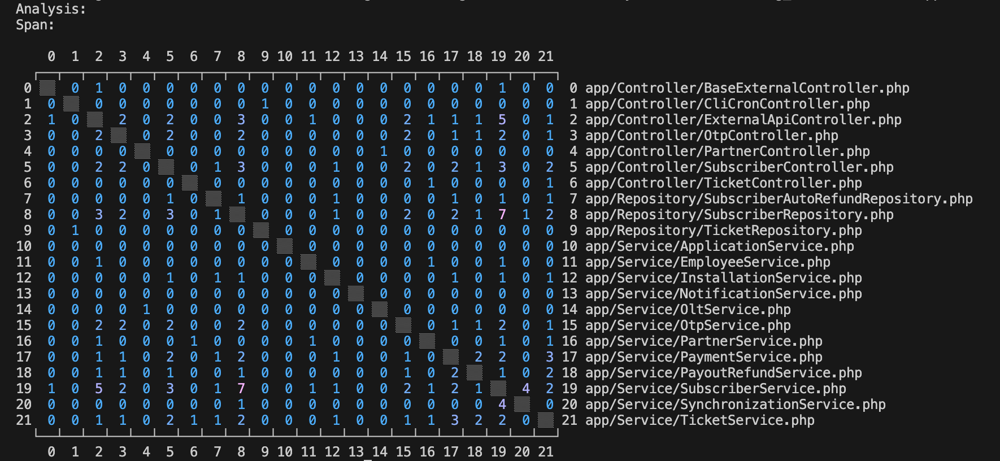

# Osmium

This is a prototype tool for exploring the dependencies between elements in a software system module by analyzing the evolution of the files that contain these elements.

## Overview

Osmium uses the DSM ([Design Structure Matrix](https://en.wikipedia.org/wiki/Design_structure_matrix)) methods to measure and visualize the cohession between files in a GitHub repository by tracking how often the files have been changed together in a logical units like Git commits or GitHub Pull Requests.
It is implemented as a CLI application with commands for generating analyses and building different views (presentations) on them.



## Concepts

- Analysis
- Span
- View

## Usage

Commands to manipulate the DSM analyses

```
osmium analysis create --name="ticketing_tixets" --source="github:pullrequest"

osmium analysis change --name="ticketing_tixets" --source="github:pullrequest"

osmium analysis delete --name="ticketing_tixets"
```

Commands to manipulate the views

```
osmium view create --analysis-name="ticketing_tixets" --name="app" --node-name="app/Controller/*.php" --node-name="app/Service/*.php" --node-name="app/Repository/*.php"

osmium view change --analysis-name="ticketing_tixets" --name="app" --node-name="app/Controller/*.php" --node-name="app/Service/*.php" --node-name="app/Repository/*.php"

osmium view render --analysis-name="ticketing_tixets" --name="app"

osmium view delete --analysis-name="ticketing_tixets" --name="app"
```
